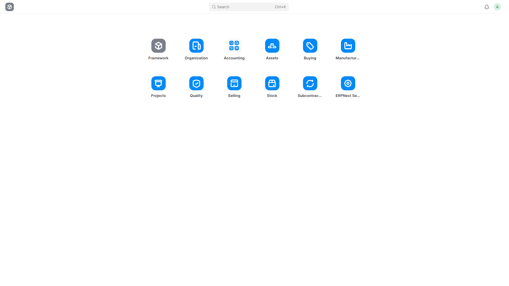
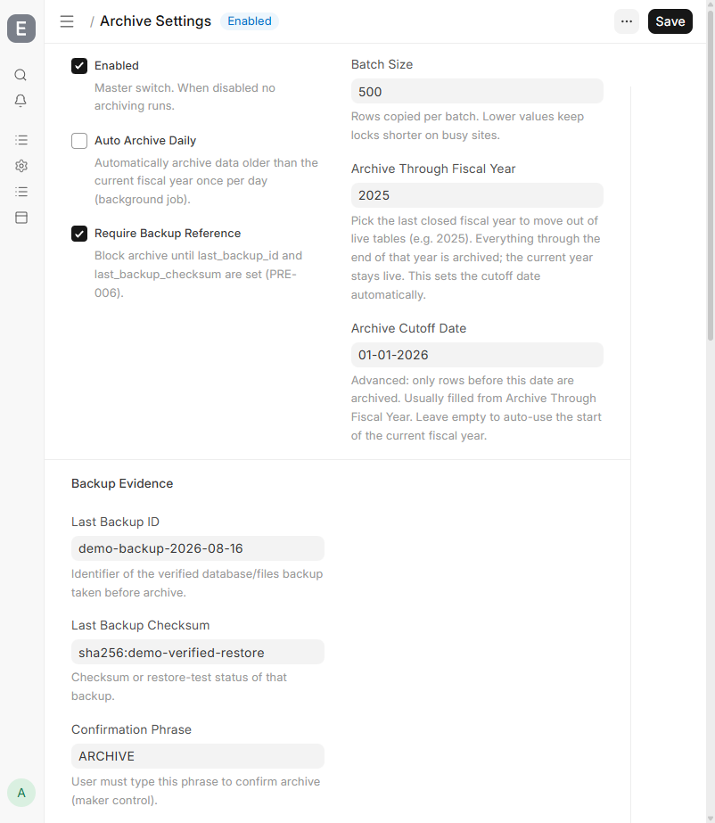
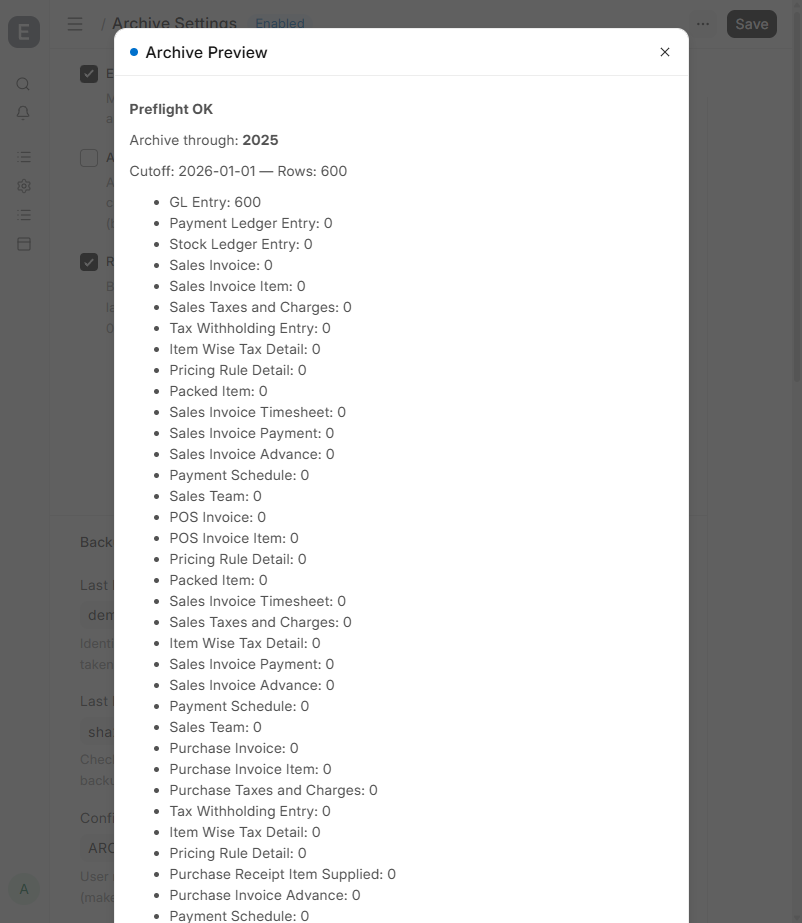
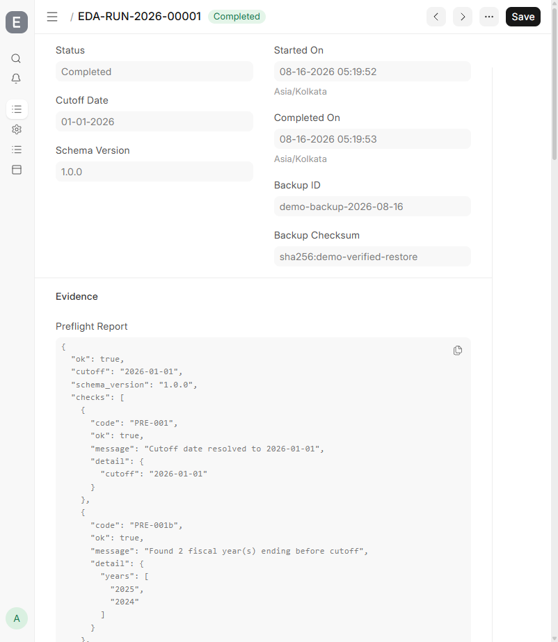
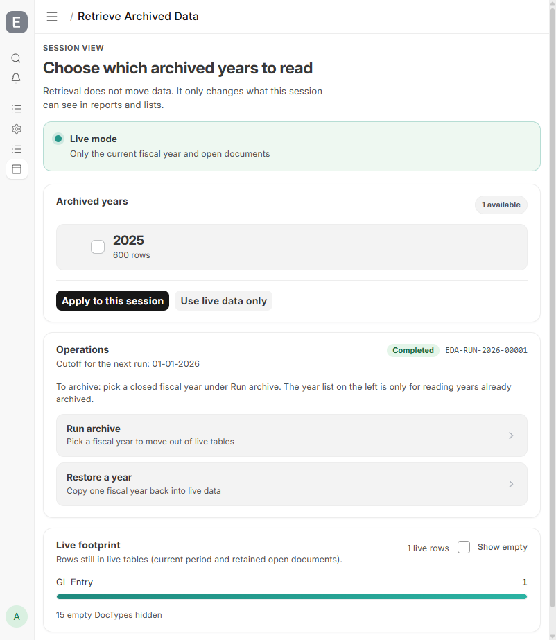
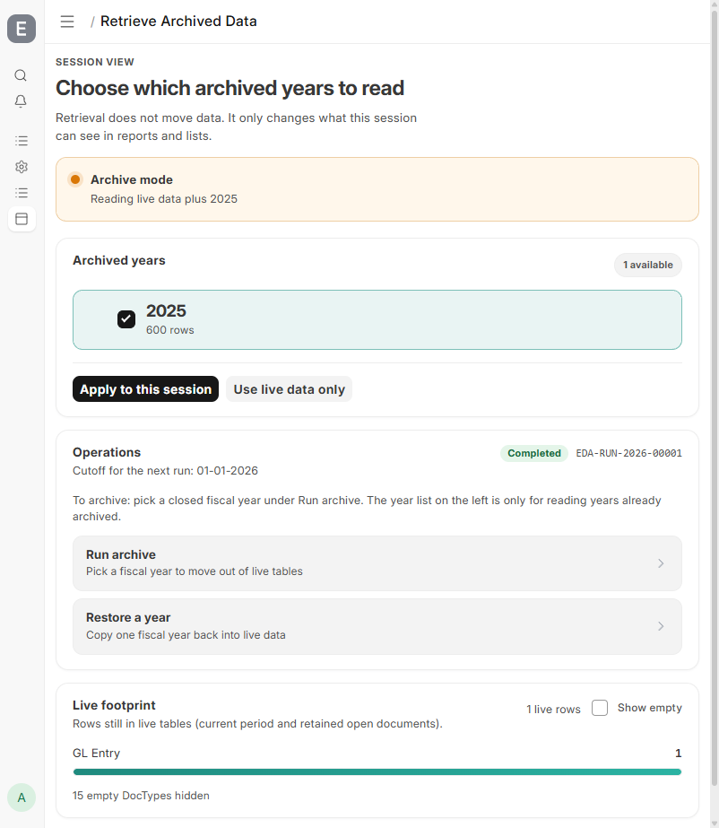

# ERPNext Data Archiver — Testing Guide

**App version:** 1.1.0  
**Date:** 2026-08-16  

For people who use ERPNext Desk. No command line needed. Follow each test in order on a **practice / staging** site first.

---

## What you need

- You can log in to ERPNext Desk  
- Your user is System Manager or Archive Manager  
- The Data Archiver app is already installed on this site  
- You are on a practice site (not the first try on live production)  
- You have a backup ID and checksum to type into Archive Settings  

---

## Test 1 — Open the app and turn it on

1. Log in to ERPNext.  
2. Search **Archive Settings** and open it.  
3. Tick **Enabled** and **Require Backup Reference**.  
4. Enter **Last Backup ID** and **Last Backup Checksum**.  
5. Set **Archive Through Fiscal Year** to a closed year (for example 2025).  
6. Click **Save**, open the page again, and check your values are still there.

| Pass if… | Fail if… |
|----------|----------|
| Page opens, Save works, values stay after refresh | Archive Settings missing, or Save errors |

---

## Test 2 — Preview before archiving

1. Stay on Archive Settings.  
2. Open the menu and choose **Preview Archive**.  
3. You should see **Preflight OK**, the year, cutoff date, and row counts.

| Pass if… | Fail if… |
|----------|----------|
| Dialog says Preflight OK | It says blocked, or asks for backup details you already entered |

If blocked: check backup fields, unfinished repost jobs, or drafts before the cutoff. Ask your implementer if unsure.

---

## Test 3 — Run the archive

1. On Archive Settings choose **Run Archive Now**.  
2. Type the confirmation word (usually `ARCHIVE`) and submit.  
3. Open **Archive Run** (search, or click the run name in the message).  
4. Wait until status is **Completed**.  
5. Under Evidence you should see report text.

| Pass if… | Fail if… |
|----------|----------|
| Status is Completed | Status is Failed, or stuck for a long time |

---

## Test 4 — Current-year reports still work

1. Open **Trial Balance** → company + current year → run.  
2. Open **Balance Sheet** → company + current year → run.  
3. Ask finance to glance at the numbers.

| Pass if… | Fail if… |
|----------|----------|
| Both reports finish without an error | Report errors, hangs, or totals look obviously wrong |

---

## Test 5 — Browse an archived year (temporary)

Retrieve only changes what **you** see in this login. It does **not** move data back permanently.

1. Search **Retrieve Archived Data**.  
2. Confirm the archived year is listed with a row count.  
3. Tick the year → **Apply to this session**.  
4. Banner should say **Archive mode**.  
5. Click **Use live data only** → banner returns to **Live mode**.

| Pass if… | Fail if… |
|----------|----------|
| Year appears; Apply turns Archive mode on; Live mode returns | No years after a Completed archive, or Apply does nothing |

---

## Test 6 — Restore a year (managers only)

Only on a practice site unless your implementer says otherwise.

1. On Retrieve, choose **Restore a year**.  
2. Pick an archived year.  
3. Read the conflict check first — ask before forcing.  
4. Confirm restore and wait until it finishes.  
5. That year’s documents should appear again in normal lists.

| Pass if… | Fail if… |
|----------|----------|
| Restore completes and the year is visible again | Errors, or you are asked to force without understanding why |

---

## Test 7 — Do not start two archives at once

1. Start **Run Archive Now**.  
2. While it is running, try again in another browser window.  
3. The second try should be refused.  
4. After the first is **Completed**, a new archive is allowed again.

| Pass if… | Fail if… |
|----------|----------|
| Second archive is blocked while the first runs | Two archives run at once with no warning |

---

## Sign-off

Print this page. For each test, circle Pass or Fail with a pen.

| Test | What you checked | Result (circle one) |
|------|------------------|---------------------|
| 1 | Archive Settings opens and saves | Pass / Fail |
| 2 | Preview shows Preflight OK | Pass / Fail |
| 3 | Archive Run ends as Completed | Pass / Fail |
| 4 | Trial Balance and Balance Sheet still work | Pass / Fail |
| 5 | Retrieve year works; Live mode returns | Pass / Fail |
| 6 | Restore works on practice site (if required) | Pass / Fail |
| 7 | Second archive is blocked while one runs | Pass / Fail |

**Before the live company site:** take a verified backup, enter ID + checksum in Archive Settings, then archive. Afterwards ask finance to check Trial Balance and Balance Sheet for the current year.

| Role | Name | Date | Signature |
|------|------|------|-----------|
| Tester | | | |
| IT / admin | | | |
| Finance | | | |
